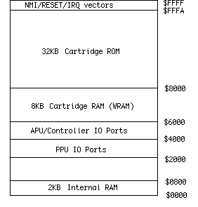

*************************
NES Architecture Overview
*************************

.. admonition:: This Week

    General overview of the NES architecture with the major components covered.
    All general purpose computers are arranged the same way with a place to
    store code (ROM), a place to store variables (RAM), and a processor to run
    code (CPU). The NES also adds another processor to generate the graphics
    (PPU) and a section of the CPU to generate audio (APU). Everything here is
    very general and will have more details than you want in the next few
    weeks.

KB
    Memory size is listed in KiloBytes or KB. 1KB = 1024 bytes.  Everything is
    powers of 2, so 2^10 = 1024 is used instead of 1000. If the capitalization
    is different, the meaning can change. Kb is Kilobits.  Divide Kb by 8 to
    get KB, because 1 byte = 8 bits.

ROM
    Read Only Memory, holds data that cannot be changed. This is where the game
    code or graphics is stored on the cart.

RAM
    Random Access Memory, holds data that can be read and written.  When power
    is removed, the chip is erased. A battery can be used to keep power and
    data valid.

PRG
    Program memory, the code for the game

CHR
    Character memory, the data for graphics

CPU
    Central Processing Unit, the main processor chip

PPU
    Picture Processing Unit, the graphics chip

APU
    Audio Processing Unit, the sound chip inside the CPU*

System Overview
===============

The NES includes a custom 6502 based CPU with the APU and controller handling
inside one chip, and a PPU that displays graphics in another chip. Your code
instructions run on the CPU and sends out commands to the APU and PPU. The NOAC
(NES On A Chip) clones like the Yobo and NEX put all of these parts onto one
chip.

|nesarchitecture|

|nesboard|

There is only 2KB of RAM connected to the CPU for storing variables, and 2KB of
RAM connected to the PPU for holding two TV screens of background graphics.
Some carts add extra CPU RAM, called Work RAM or WRAM. If a cart needs to store
saved games, this WRAM will have a battery attached to make sure it isn't
erased. A few carts add extra PPU RAM to hold four screens of background
graphics at once. This is not common. The rest of this tutorial will not use
WRAM or four screen RAM.

Each cart includes at least three chips. One holds the program code (PRG),
another holds the character graphics (CHR), and the last is the lockout. The
graphics chip can be RAM instead of ROM, which means the game code would copy
graphics from the PRG ROM chip to the CHR RAM. PRG is always a ROM chip.

Lockout Chip
------------

Inside the NES and the cart are also two lockout chips. The lockout chip
controls resetting the console. First the NES lockout sends out a stream ID,
0-15. The cart lockout records this number. Then both lockout chips run a
complex equation using that number and send the results to each other. Both
chips know what the other is supposed to send so they both know when something
is wrong. If that happens the system enters the continuous reseting loop. This
is the screen flashing you see with a dirty cart.

When you cut pin 4 of the NES lockout chip, you are making it think it is
inside the cart. It sits there waiting for the ID from the NES which never
happens, so the system is never reset. If you were to completely remove the NES
lockout chip the system would not work because it controls the reset button.

Most lockout defeaters used by the unlicensed game companies used large voltage
spikes sent from the cart to the NES lockout. When timed right those would
crash the NES lockout, preventing it from resetting the system. Nintendo slowly
added protection against those on the NES board.  Next time you open your NES,
check the board for the revision number.  Right in the middle it will say
NES-CPU- then a number. That number is the revision. If you have 05 it is an
early one. 07 and 09 added some lockout protection. 11 was the last version
with the most lockout protection. Almost all unlicensed carts that use lockout
defeaters will not work on a NES-CPU-11 system.

CPU Overview
------------

The NES CPU is a modified 6502, an 8 bit data processor similar to the Apple 2,
Atari 2600, C64, and many other systems. By the time the Famicom was created it
was underpowered for a computer but great for a game system.

The CPU has a 16 bit address bus which can access up to 64KB of memory.  2^16 =
65536, or 64KB. Included in that memory space is the 2KB of CPU RAM, ports to
access PPU/APU/controllers, WRAM (if on the cart), and 32KB for PRG ROM. The 16
bit addresses are written in hex, so they become 4 digits starting with a $
symbol. For example the internal RAM is at $0000-0800. $0800 = 2048 or 2KB.
32KB quickly became too small for games, which is why memory mappers were used.
Those mappers can swap in different banks of PRG code or CHR graphics. Mappers
like the MMC3 allowed up to 512KB of PRG, and 256KB of CHR. There is no limit
to the memory size if you create a new mapper chip, but 128KB PRG and 64KB CHR
was the most common size.

|cpumemmap|

PPU Overview
------------

The NES PPU is a custom chip that does all the graphics display. It includes
internal RAM for sprites and the color palette. There is RAM on the NES board
that holds the background, and all actual graphics are fetched from the cart
CHR memory.

Your program does not run on the PPU, the PPU always goes through the same
display order. You only set some options like colors and scrolling.  The PPU
processes one TV scanline at a time. First the sprites are fetched from the
cart CHR memory. If there are more than 8 sprites on the scanline the rest are
ignored. This is why some games like Super Dodge Ball will blink when there is
lots happening on screen. After the sprites the background is fetched from CHR
memory. When all the scanlines are done there is a period when no graphics are
sent out. This is called VBlank and is the only time graphics updates can be
done. PAL has a longer VBlank time (when the TV cathode ray gun is going back
to the top of the screen) which allows more time for graphics updates. Some PAL
games and demos do not run on NTSC systems because of this difference in VBlank
time. Both the NTSC and PAL systems have a resolution of 256x240 pixels, but
the top and bottom 8 rows are typically cut off by the NTSC TV resulting in
256x224. TV variations will cut off an additional 0-8 rows, so you should allow
for a border before drawing important information.

NTSC runs at 60Hz and PAL runs at 50Hz. Running an NTSC game on a PAL system
will be slower because of this timing difference. Sounds will also be slower.

|ppumemmap|

Graphics System Overview
========================

Tiles
-----

All graphics are made up of 8x8 pixel tiles. Large characters like Mario are
made from multiple 8x8 tiles. All the backgrounds are also made from these
tiles. The tile system means less memory is needed (was expensive at the time)
but also means that things like bitmap pictures and 3d graphics aren't really
possible. To see all the tiles in a game, download `Tile Molester
<http://www.zophar.net/utilities/download/TileMolester_015a_bin.zip>`__ and
open up your .NES file. Scroll down until you see graphics that don't look like
static. You can see that small tiles are arranged by the game to make large
images.

Sprites
-------

The PPU has enough memory for 64 sprites, or things that move around on screen
like Mario. Only 8 sprites per scanline are allowed, any more than that will be
ignored. This is where the flickering comes from in some games when there are
too many objects on screen.

Background
----------

This is the landscape graphics, which scrolls all at once. The sprites can
either be displayed in front or behind the background. The screen is big enough
for 32x30 background tiles, and there is enough internal RAM to hold 2 screens.
When games scroll the background graphics are updated off screen before they
are scrolled on screen.

Pattern Tables
--------------

These are where the actual tile data is stored. It is either ROM or RAM on the
cart. Each pattern table holds 256 tiles. One table is used for backgrounds,
and the other for sprites. All graphics currently on screen must be in these
tables.

Attribute Tables
----------------

These tables set the color information in 2x2 tile sections. This means that a
16x16 pixel area can only have 4 different colors selected from the palette.

Palettes
--------

These two areas hold the color information, one for the background and one for
sprites. Each palette has 16 colors.

To display a tile on screen, the pixel color index is taken from the Pattern
Table and the Attribute Table. That index is then looked up in the Palette to
get the actual color.

|pputile|

To see all the graphics, download the `FCEUXD SP emulator
<http://www.the-interweb.com/serendipity/exit.php?url_id=627&entry_id=90>`__.
Open up your .NES game and choose PPU Viewer from the Tools menu. This will
show you all the active background tiles, all the active sprite tiles, and the
color palettes. Then choose Name Table Viewer from the Tools menu. This will
show you the backgrounds as they will appear on screen. If you choose a game
that scrolls like SMB you can see the off screen background sections being
updated.

.. |nesarchitecture| image:: images/nesarchitecture.png
.. |nesboard| image:: images/nesboard.png

.. |ppumemmap| image:: images/ppumemmap.png
.. |pputile| image:: images/pputile.png
